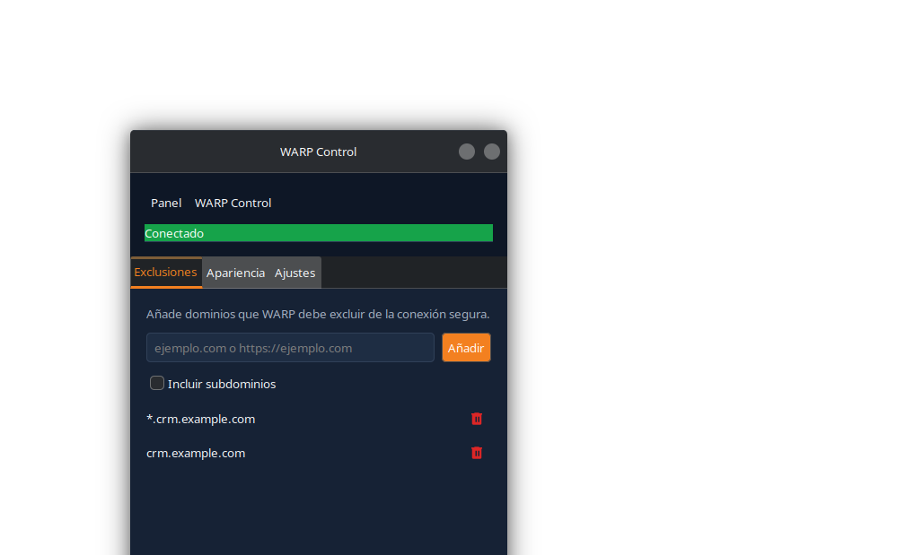
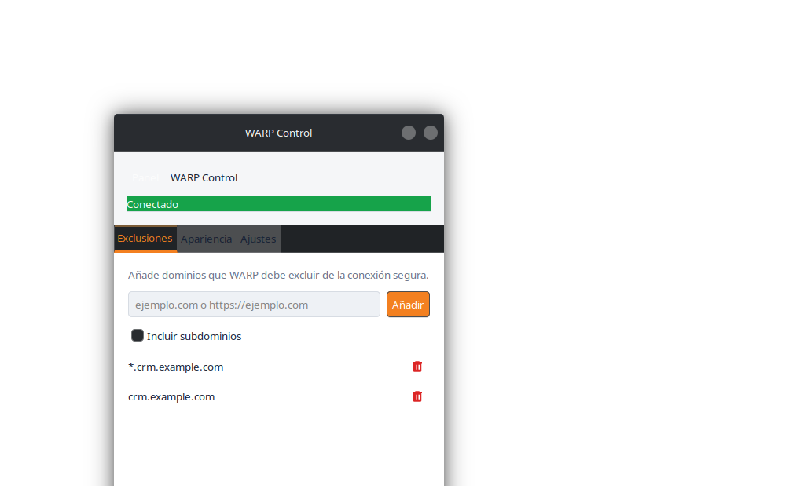
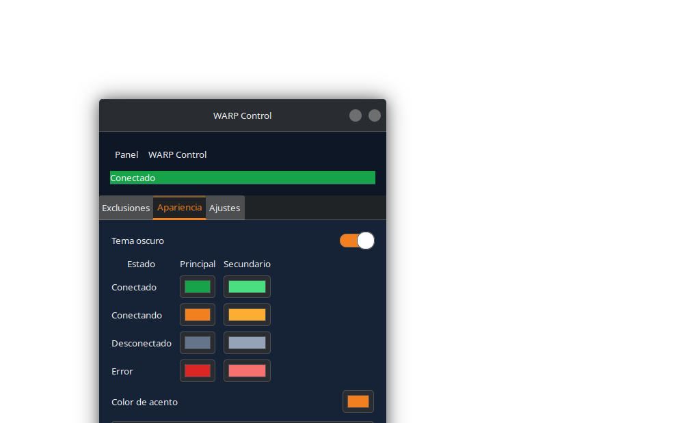
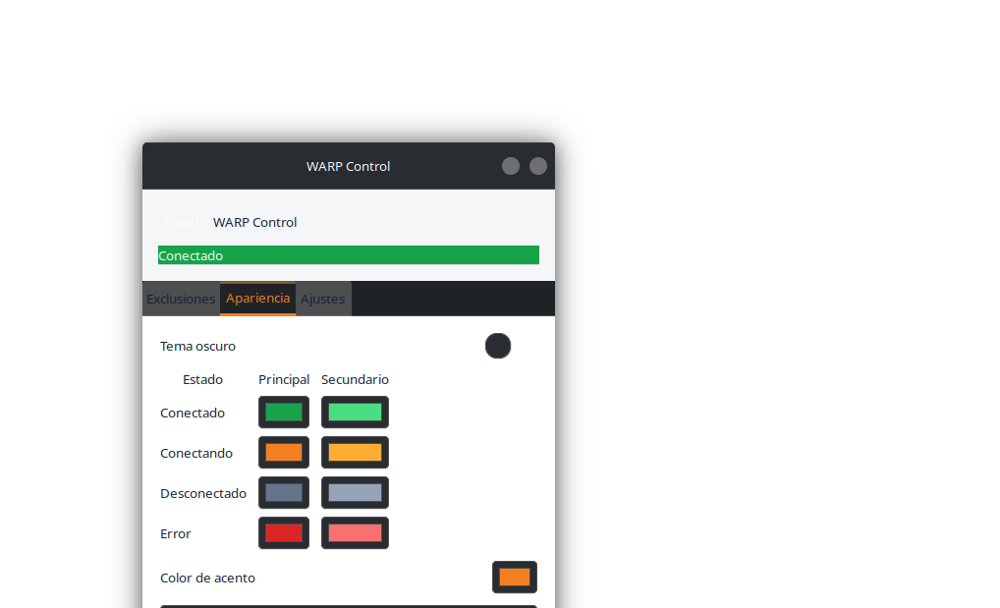
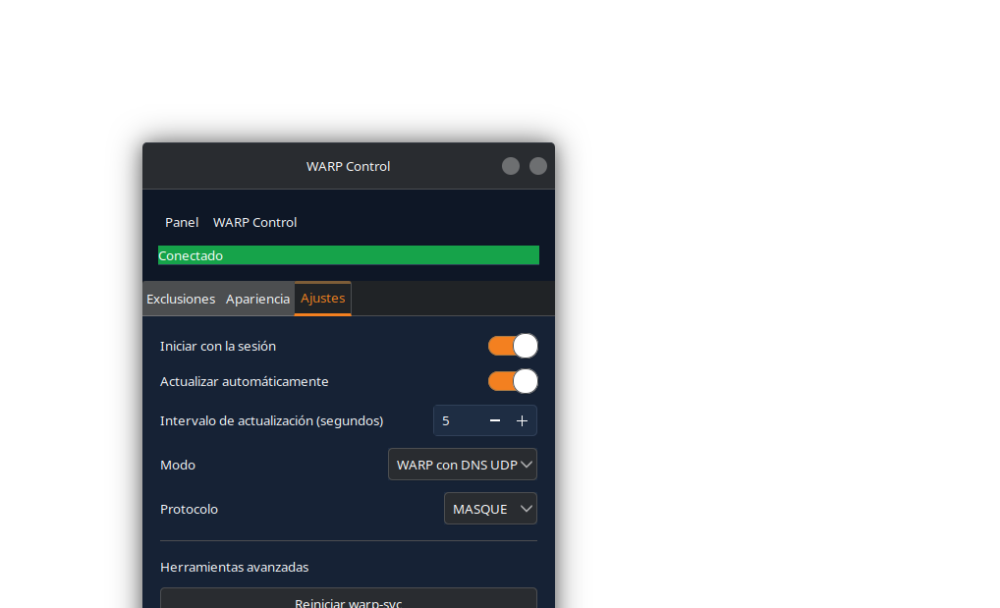
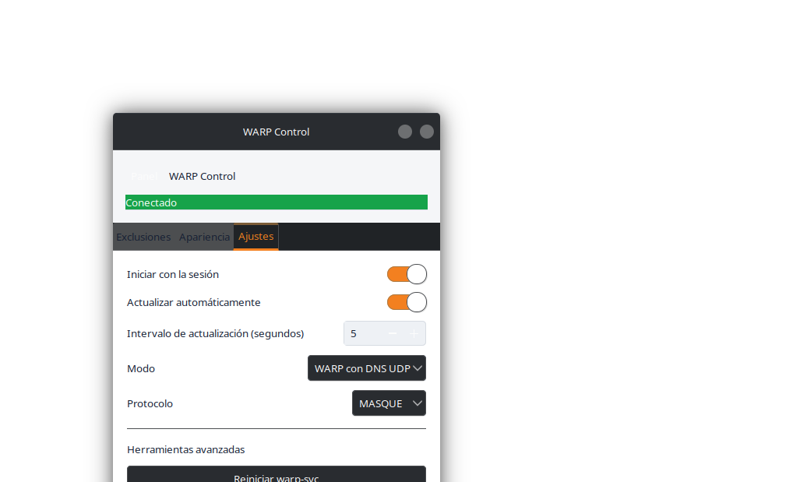

# WARP Control

Panel de escritorio GTK para Cloudflare WARP. Es un proyecto de portafolio con
una base Python revisable, integración nativa de bandeja y paquetes para las
familias RPM y Debian; Arch se entrega como PKGBUILD experimental.

WARP Control no incluye Cloudflare WARP, no modifica repositorios durante la
instalación del paquete y nunca instala software de terceros sin una
confirmación explícita. Al abrirse, detecta si `warp-cli` falta y explica el
flujo oficial antes de pedir autorización mediante PolicyKit.

## Qué ofrece

- Estado, conexión y desconexión de WARP desde una ventana GTK y la bandeja.
- Exclusiones de split tunnel con normalización IDNA y soporte de subdominios.
- Colores por estado y acento configurables; el icono de la barra respeta esos
  colores.
- Tres pestañas de configuración del mismo ancho: Exclusiones, Apariencia y
  Ajustes (inicio de sesión, actualización, modo, protocolo y herramientas).
- Instalador local de paquetes con detección de familia y sin descargas ocultas.

## Vista previa

| Tema oscuro | Tema claro |
| --- | --- |
|  |  |
|  |  |
|  |  |

Las imágenes se capturaron contra la interfaz GTK real en el backend Broadway;
no son maquetas.

## Instalación

Consulta [INSTALL.md](docs/INSTALL.md) para construir e instalar el artefacto
correcto para Fedora/RHEL, Debian/Ubuntu o Arch. Consulta
[SUPPORT.md](docs/SUPPORT.md) para la matriz de soporte de WARP y sus límites.

Después de instalar un paquete, abre **WARP Control** desde el menú de
aplicaciones o ejecuta:

```bash
warp-control
```

## Arquitectura y seguridad

La separación entre UI, controlador, servicio WARP y helper privilegiado está
explicada en [ARCHITECTURE.md](docs/ARCHITECTURE.md). El helper PolicyKit solo
acepta acciones y argumentos validados, fija la huella de la clave de
Cloudflare y no se ejecuta desde scripts de mantenimiento de paquetes.

## Desarrollo

```bash
python3 -m venv --system-site-packages .venv
.venv/bin/pip install -e . pytest ruff
.venv/bin/pytest -q
.venv/bin/ruff check .
```

El proyecto requiere Python 3.9+, GTK 3 y PyGObject para ejecutar la interfaz.
Las pruebas de UI se omiten automáticamente cuando no hay una pantalla.

## Licencia

[MIT](LICENSE). Consulta [CHANGELOG.md](CHANGELOG.md) para el historial de la
versión 2.0.0.
