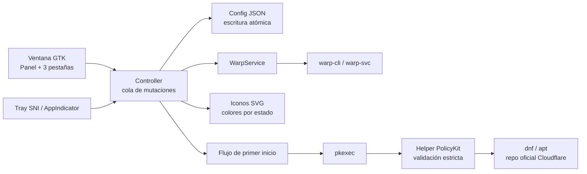

# Arquitectura

WARP Control separa las decisiones de interfaz de las operaciones que afectan
al túnel. El proceso gráfico no compone comandos de shell ni asume privilegios.

## Límite de confianza

Todo hasta `pkexec` se ejecuta como el usuario de escritorio. El helper
privilegiado recibe solo acciones enumeradas y argumentos con formato
validado; además comprueba UID efectivo, distribución soportada, origen de
paquete y la huella pública esperada de Cloudflare. Los subprocessos se lanzan
como listas de argumentos, sin `shell=True`.

El paquete RPM/DEB no declara `cloudflare-warp` como dependencia ni ejecuta un
`%post`/`postinst` que añada repositorios. Así el usuario puede auditar la
acción en la aplicación antes de que se pida elevación. En Arch, no hay helper
de instalación: la procedencia comunitaria se muestra como experimental.

## Módulos

| Área | Responsabilidad |
| --- | --- |
| `models` y `config` | Modelo versionado, migración y persistencia atómica. |
| `services` | Detección de capacidades y operaciones WARP con rollback. |
| `controller` | Serializa cambios, descarta snapshots viejos y registra metadatos. |
| `ui` | Ventana, bandeja, CSS e iconos sin lógica privilegiada. |
| `libexec/warp-control` | Helpers llamados únicamente por la política PolicyKit. |
| `packaging` | RPM, Debian y Arch como fuentes separadas y revisables. |

## Configuración y datos

La configuración vive en `~/.config/warp-control/config.json`. Contiene
preferencias locales —nunca tokens ni contraseñas— y se actualiza mediante
archivo temporal privado y reemplazo atómico. Los registros se rotan y guardan
metadatos operativos, no comandos con secretos.
